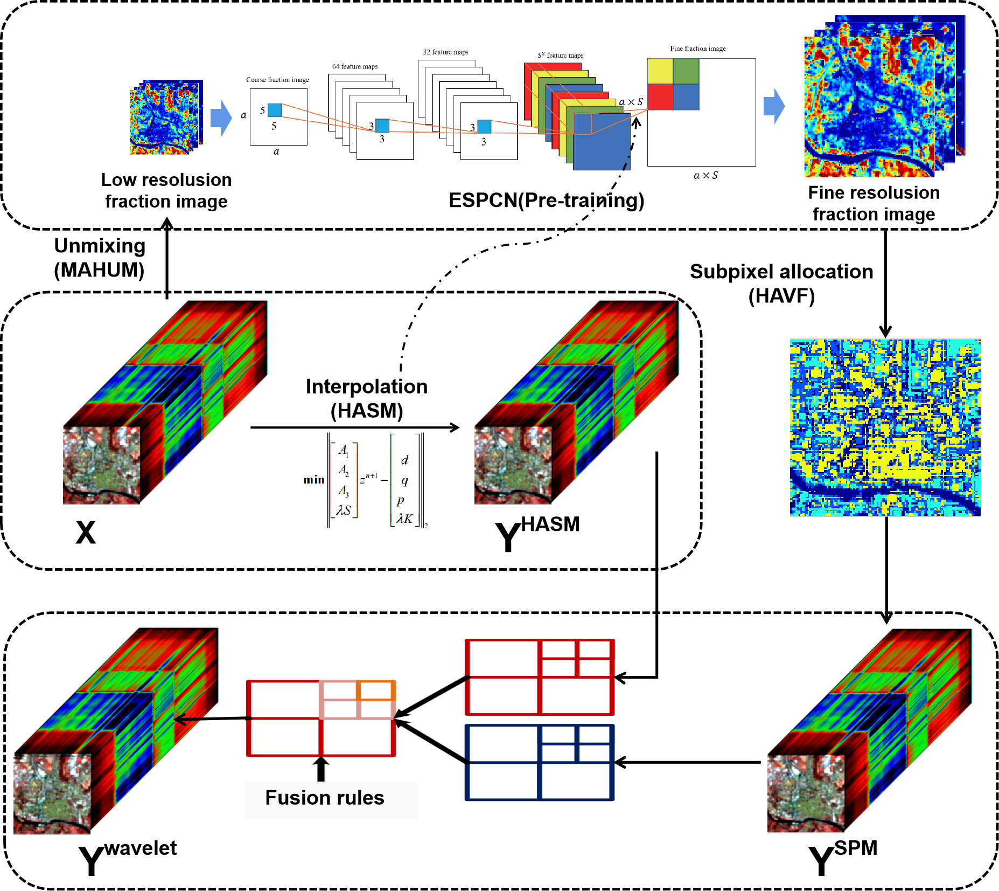
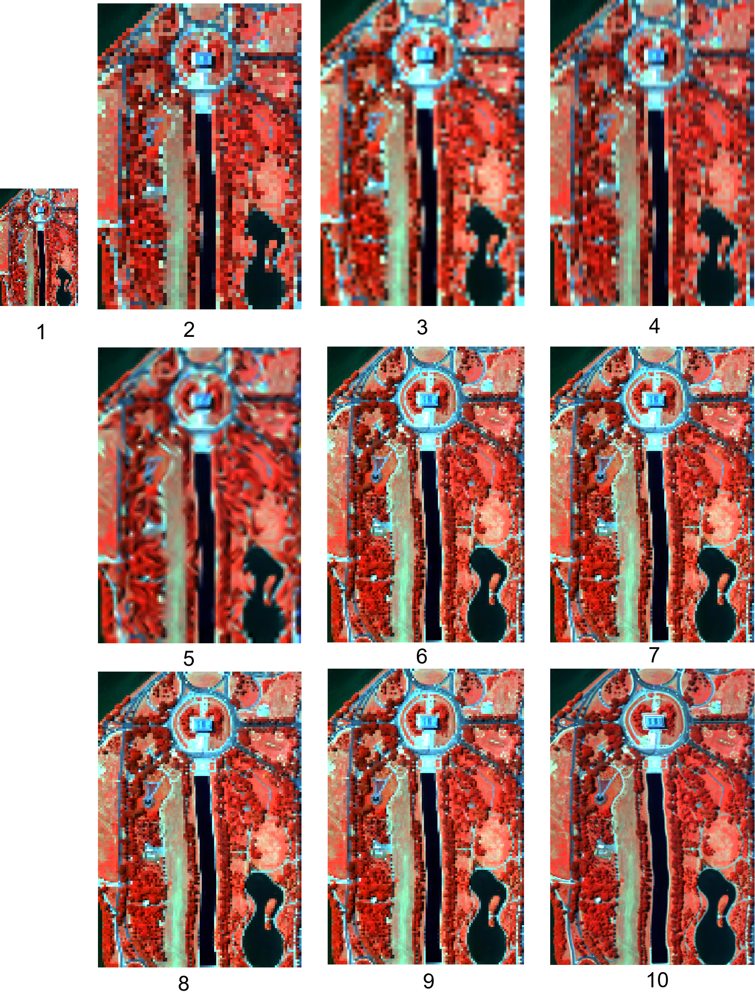
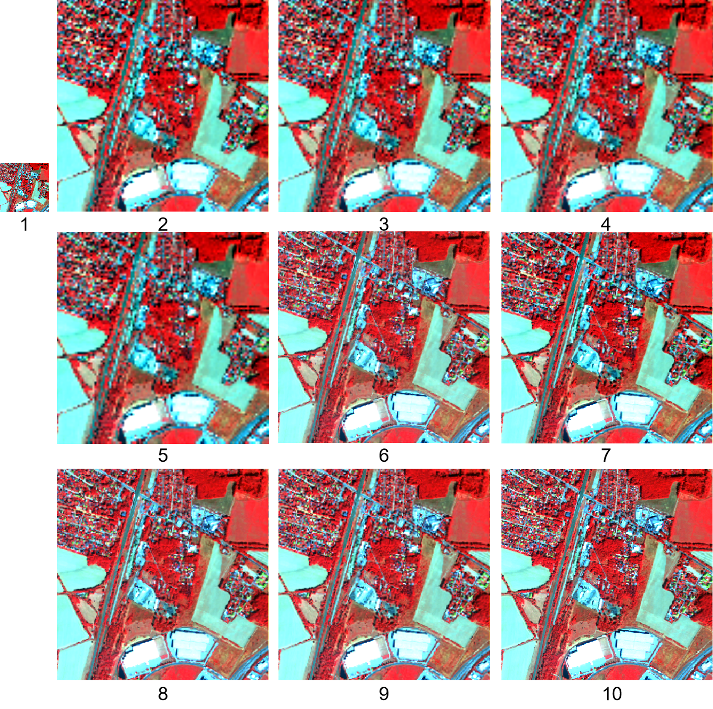

# Enhancing the Spatial Resolution of Hyperspectral Images Combining High Accuracy Surface Modeling and Subpixel Unmixing
#
This article This article is currently being submitted.

This work is a substantially improved version of the work entitled `URBAN HYPERSPECTRAL IMAGE SUPER-RESOLUTION COMBINING SUBPIXEL
MAPPING AND INTERPOLATION'', which will be presented in July 2024 at the 2024 IGARSS conference in Athens (Greece).

or, If you have any question, please do not hesitate to contact me.

chen_jia@cug.edu.cn

Usage
---------------------
## Abstract

Hyperspectral sensors can rapidly acquire high-quality spectral data, very useful for urban monitoring applications. Unfortunately, their spatial detail is not fine enough, and methods to enhance this resolution are required. However, conventional super-resolution methods for multispectral data do not match the requirements needed to maintain high spectral fidelity.
Therefore, this paper proposes a hyperspectral super-resolution method that combines subpixel mapping and interpolation, and whose main aim is to enhance urban monitoring. This method aims to guarantee the spectral quality and minimize computational time through a high-precision surface interpolation method based on curve theory. Moreover, unmixing-based subpixel mapping is exploited to introduce unmixing information. Finally, by employing wavelet transforms, the method integrates the effective information from the two previous approaches, obtaining urban hyperspectral images with enhanced spatial details and spectral fidelity. This method has been subjected to a comprehensive experimentation, affirming that the proposed method surpasses the current state-of-the-art super-resolution results in terms of performance and effectiveness.

### Flowchart of the algorithm model.

## Preliminary preparation

Torch

Numpy

## Dataset

### Pavia Hyperspectral Dataset

	The Pavia hyperspectral dataset features urban imagery from the city of Pavia, Italy. This data was acquired by the PRISMA satellite and includes 199 spectral bands covering the visible to near-infrared spectrum. Each image has a spatial resolution of $1024 \times 1024$ pixels, with each pixel size being approximately 1.3 meters on the ground, providing detailed urban structure and material composition insights. The selected hyperspectral dataset comprises $199$ spectral bands, providing a comprehensive coverage across the visible to near-infrared spectrum. Each spectral band contains $120 \times 120$ pixels, resulting in a granular high-resolution image that captures intricate details of the urban landscape. This high level of detail is crucial for applications such as land cover classification, vegetation detection, and urban infrastructure analysis.

### Washington DC Hyperspectral Dataset
The Washington DC hyperspectral dataset encompasses high-resolution imaging of the urban areas of Washington DC, USA. The dataset includes 191 spectral bands, with a spectral coverage from 400 nm to 2500 nm. The images feature a spatial resolution of $1.5 \times 1.5$ meters per pixel, which allows for detailed mapping of urban materials, land use, and environmental monitoring. This dataset is crucial for governmental and environmental applications focusing on urban management and development planning.
	
### Berlin-Urban-Gradient Dataset (EnMAP)
	The Berlin-Urban-Gradient dataset, collected as part of the Environmental Mapping and Analysis Program (EnMAP), offers hyperspectral imagery of Berlin, Germany. It comprises over 240 spectral bands with a spectral range from 420 nm to 2450 nm. The dataset provides images at a spatial resolution of $30 \times 30$ meters per pixel, suitable for analyzing urban landscapes, vegetation health, and pollution levels in both urban and peri-urban areas.

## Experimental result

### result 1 （Pavia）.

### result 2（Washington DC）.

### result 3（Berlin Urban）.

